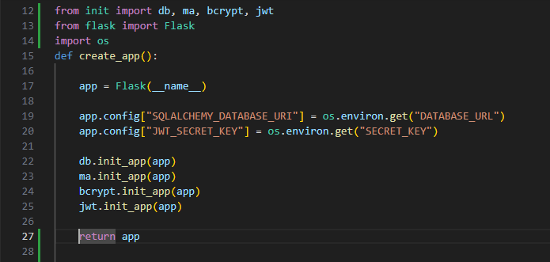
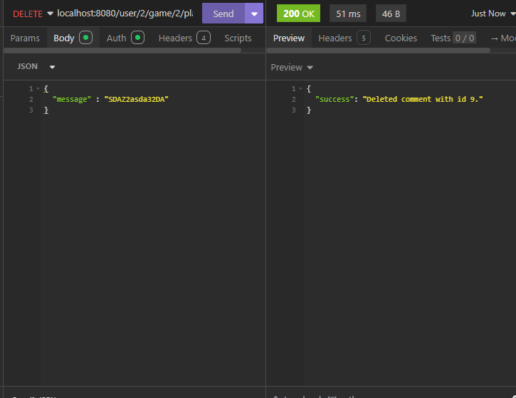

# T2A2 API WebServer - Game Event Tracker

## Table of Contents  
[R1 - Explain the problem you are trying to solve and how the app solves the problem](#r1)  
[R2 - Task Management - Trello and Github](#r2)  
[R3 - Third-Party Services, Packages & Dependencies](#r3)  
[R4 - Benefits and drawbacks of PostgreSQL](#r4)  
[R5 - Explain features, purpose and functionalities of ORM in the app](#r5)  
[R6 - An ERD for your app](#r6)  
[R7 - Explain models and their relationships and explain how relationships aid database implementation:](#r7)    
- [User Model](#users)  
- [Game Model](#games)  
- [Player Model](#players)  
- [Comments Model](#comments)  
- [Events Model](#events)
      
[R8 - Explain app's API endpoints:](#r8)  
- [User Controller](#user-controller)  
- [Game Controller](#games-controller)  
- [Player Controller](#players-controller)  
- [Comments Controller](#comments-controller)  
- [Events Controller](#event-controller)


### R1
### Explain Solved Problem
With the increasing popularity of games, the management and analysis of past in-game events becomes increasingly more significant as the player base and complexities of games evolve. A common denominator within most games is the absence of in-game event tracking whereby players have a way to execute events but they do not have a way to review each past event committed. Having an event tracker can help players review any changes to their characters and track the progressive development of characters on an ongoing basis, this can help prevents users from spending far too much time on the game if they have progressed a certain amount and for users that are forgetful, they're able to account for what they previously did with their players. 

### Explain How problem is addressed and References
This app works by using


## R2 Task allocation and Management - Trello & GitHub
### Trello
For this application Trello was used for management of tasks and acted as a sort of checklist to ensure all rubric was covered and completed as well as the flow of creating the application was consistent and gradual. Specific dates were allocated to each task and objective to ensure the application was progressing according to plan towards the submission date. Trello was used for organisation of the project, time management and tracking tasks as well as visualises the workflow. Each card used a colour coded system for categorisation of tasks and different cards were allocated to define milestones and deadlines. Checklists within each card were to help break down components of each card further and to emphasise points required for the rubric of the T2A2 Webserver assignment.

#### Trello web link:
[https://trello.com/b/9sVow73W/t2a2-api-webserver](https://trello.com/b/9sVow73W/t2a2-api-webserver)

#### Reference


### GitHub
Github was used to track changes and recovery of data if necessary. Throughout the length of the project each file that had been completed had a git operation performed to push the local repository changes to a remote repository (github) to help with debugging, organisation and collaboration (where necessary). GitHub was also used as a requirement for this assignment T2A2 to help track changes to the project.

#### Example of how this was done
1. Login to Github and create a new repository
2. Create new local directory on computer
3. Open Ubuntu
4. Initialise local repository with: ```git init```
5. Echo a read me file: ```echo "T2A2" >> README.md```
6. Add any changes to a staging area for the current directory: ```git add .```
7. Commit changes in staging area with a meaningful message: ```git commit -m "first commit"```
8. Ensure the current branch is main: ```git branch -M main```
9. Add origin of remote repository: ```git remote add origin git@github.com:peter-duongGHub/T2A2-1.git```
10. Push upstream to the main branch as origin: ```git push -u origin main```

#### GitHub web link
[https://github.com/peter-duongGHub/T2A2](https://github.com/peter-duongGHub/T2A2)

#### Reference


## R3
### Dependencies 
An extensive explanation of each dependency used in this application can be found below:
> Prior to installation of each package users should work in a virtual environment to prevent conflictions with other project dependency versions:

### Installation:
#### Virtual Environment
Virtual environment is used to keep my dependencies contained for this specific project to reduce contingencies and overlap with other projects users might be involved with - maintaining module versions and preventing overlapping of dependency versions.

1. Setup virtual environment

```python3 -m venv venv```

2. Activate the virtual environment

``` source venv/bin/activate```

#### Psycopg2
Psycopg2 is a popular PostgreSQL adapter for Python that provides a robust interface for connecting to and interacting with PostgreSQL databases. It’s designed to be efficient, secure, and easy to use, making it one of the most widely used libraries for PostgreSQL database management in Python applications such as my game event tracker application. It acts as a mediator between my application logic and PostgreSQL ensuring operations and requests to the database function smoothly. 

##### Installation
1. Install psycopg2 package

``` pip install psycopg2-binary```

##### Description

#### Python Dotenv
Python dotenv is used in this application to help with configuration setttings stored within an .env file. This helps with modularisation as it seperates the application logic from the configuration data. It is utilised to help with configuring the jwt secret key, database URL, database adapter, user and password. For the example below the ```os``` module is imported and used with ```os.environ.get("variable")``` to link the configuration settings to the .env file where ```("variable")``` would be replaced with the configuration setting variable such as ```SECRET_KEY``` in the .env.example file.

Example:





##### Installation
1. Install python-dotenv package

``` pip install python-dotenv```


#### PostgreSQL
PostgreSQL is the database system that my application will be using. The purpose of PostgreSQL is to act as an relational database management system (RDBMS) by storing data within tables that consist of rows and columns. Specifically for this application, PostgreSQL is used to help store user input into a relational database. This is greatly beneficial for users who use my API webserver as they can store data and retrieve that stored data whenever necessary.
It contains many components and features that are used within this application such as constraints including:
- Primary Keys
- Foreign Keys
- Unique Constraints
- Default Constraints
- Nullable Constraints

#### Flask
Flask is a lightweight web framework for Python that allows developers to build web applications quickly and easily. Flask depends on the Werkzeug WSGI toolkit, the Jinja template engine, and the Click CLI toolkit. It does have many cool features like url routing, template engine. The example provided below shows the features of flask that have been utilised for the application. This example code shows flask may be used to map URL's to controllers and return a view. This is very handle as different routes can be defined with this decorator to facilitate different functions dependent on the route. This is a fundamental feature when building applications on the web as it plays a significant role in user interaction and interface.

https://flask.palletsprojects.com/en/3.0.x/

#### Example code
```
@app.route('/')
def home():
    return 'Hello, World!'`
```

#### SQLAlchemy
SQLAlchemy is used within the game event tracking application to assist with database CRUD operations such as retrieving values from an entity within the relational database etc. It is also used within the database tables for attributes and data type definitions, commits to the database session and scalars for executing of the database object. This example shows ```db.Select``` is used to fetch an object from the model ```Games``` and return it to the view with the use of Marshmallow.

#### Example
```
@game_bp.route("/<int:game_id>", methods=["GET"])
def view_games(game_id):
    stmt = db.Select(Games).filter_by(id=game_id)
    game = db.session.scalar(stmt)

    if game:
        return game_schema.dump(game), 200
    else:
        return{"error": f"There is no game with id: {game_id}"}
```

##### flask_sqlalchemy
1. Install flask_sqlalchemy package

``` pip install flask_sqlalchemy```

#### Marshmallow
For this application marshmallow has been used to create my schemas and help with serialising and deserialising my python objects into a readable object for the view. It has also been used to help define the specific attributes that will be accessed by different tables as well as validation of inputs by the user - restricting users to certain inputs and conditions. 

An example of how marshmallow has been used extensively in my application has been provided below. 

##### Use within application
In this example I have used marshmallow to create a schema class model named ```GameSchema``` and used many of marshmallows features such as ```fields``` and ```validate```. Some methods of fields were used for different purposes. ```Nested``` was used to define which attributes from other tables were going to be availble for use, ```String``` was used for validating user input and ensuring user input is compulsory.


##### flask_marshmallow
1. Install flask_marshmallow package

``` pip install flask_marshmallow```

##### marshmallow_sqlalchemy
1. Install marshmallow_sqlalchemy package

``` pip install marshmallow_sqlalchemy```


#### JWT Manager
JWT Manager is a popular Flask extension that provides easy integration of JSON Web Tokens (JWT) into the game event tracker application. Within this application it enables management of user authentication and authorization and retrieval of attribute id's with the use of ```get_jwt_identity()``` for display in the view.

#### Example
```
@game_bp.route("/", methods=["POST"])
@jwt_required()
@check_admin
def create_game():
    request_data = request.get_json()
    name = request_data.get("name")
    description = request_data.get("description")
    stmt = db.Select(Users).filter_by(id=get_jwt_identity())
    user = db.session.scalar(stmt)

    game = Games(
        name = name,
        description = description,
        user_id = user.id
        )

    db.session.add(game)
    db.session.commit()
    return game_schema.dump(game), 201
```

##### flask_jwt_extended
1. Install flask_jwt_extended package

``` pip install flask_bcrypt```

#### Bcrypt
Bcrypt is used within this application for its cryptographic hashing function designed specifically for securely storing passwords input by the user into the database. The example below shows how bcrypt has been used in this application to hash the user input password into a database object. Bcrypt has also been used to verify user's when logging in by comparing the user input password to the stored hashed password to see if they are the same - this assists in authenticating users upon logging in with the application.

#### Example
```
  user.password = bcrypt.generate_password_hash(request_password).decode("utf-8") or user.password
```

##### flask_bcrypt
1. Install flask_bcrypt package

``` pip install flask_bcrypt```

## R4 - PostgreSQL
PostgresQL is a catalog-driven, object relational database management system (ORDBMS) that is open source and is popularly utilised by multiple users due to its diverse functionality, features, stability, dependability & efficient implementation. It supports relational and non-relational queries such as SQL and JSON respectively (The PostgreSQL Global Development Group, 2019). PostgreSQL stores data in tables columns and rows, whilst data is written and read using SQL language. A major variant of PostgreSQL in comparison to other relational database systems is the additional quantity of information stored such as; data types, access methods and functions, extending its routine storage of tables and columns in catalogs(Hassan, 2022). 

### Application
Its benefits range from its exceptional extensible nature and its consistent compliance to guidelines. With the use of functions such as MVCC, it is capable of concurrent database interactions within multi-user environments which will be further discussed below. 
(Kengalagutti, n.d.). PostgreSQL is known to be used as a DBMS in the financial industry, many industrial manufactures and works with multiple web frameworks such as Django and PHP(Peterson, 2019).

### Features 
PostgreSQL acts as a principal database for information throughout many applications, devices, the web and functions as software that enables reading, writing and modifying relational databases(Peterson, 2019). Its highly extensible nature allows for its use across multiple programming languages such as Ruby, Python and Java. Its multifaceted nature facilitates the creation of defined data types and customised functions. Another significant element of PostgreSQL is its conformance to standardised SQL requirements and a majority of features that are obligatory for SQL(Peterson, 2019). 

#### Data Definition Language (DDL)
Data definition is a feature of PostgreSQL that is involved in modifications, definitions & structuring of databases & schemas. Using DDL is useful in storing data within the database and altering the structural integrity of the database, such as making aliases, altering columns, dropping columns or creating tables (Commandprompt.com, 2023).

- Create Tables  
The statement ```'CREATE TABLE'``` will create a table within a database. Syntax of these statements ends with a ```;```. This specific example discussed will create a table named ```students``` with attributes ```Teacher_ID, Name, Subject``` with their respective datatypes and constraints(Awati, 2022).

``` 
CREATE TABLE students
(
  Teacher_ID INT PRIMARY KEY,
  Name VARCHAR(50) NOT NULL,
  Subject VARCHAR(50) NOT NULL,
); 
```

- Alter Constraints or columns  
The statement ```ALTER TABLE``` will alter a database tables constraints or columns. Syntax involves ending these statements ends with a ```;```. This specific example discussed will alter a table named ```students``` by adding a column named ```column_name``` with data type ```data_type```(Awati, 2022).

```
ALTER TABLE students ADD column_name data_type;
```

##### DCL   
Delete command line (DCL) is a statement used to amputate multiple or singular record entries from existing tables within a database. The ```WHERE``` clause may be used to specify a row of the database table. This example deletes a data entry depending on the ```WHERE condition```
(AWS, 2024).
```
DELETE FROM table_name WHERE condition;
```

### Benefits of Using PostgreSQL
As one of the most popular databases, PostgreSQL has manifold benefits ranging from extensibility, reliability, scalability, ACID compliance & multiversion concurrency control to name a few(PostgreSQL Documentation, 2024). Elaborate optimisations with queries within larger data sets makes PostgreSQL a better alternative. Some key benefits that cement PostgreSQL's practicality will further be discussed below:

#### Multiversion concurrency control (MVCC)  
MVCC is a method to handle concurrency within PostgreSQL, used to enhance and optimise databases when numerous processes require the same database (devcenter.heroku.com, n.d.). It works on the basis of providing optimisation for multi-user environments by providing continual integrations of changes to databases eschewing locking mechanisms which are utilised by other database systems. This is completed through the utilisation of advanced techniques and multiversion models (PostgreSQL Documentation, 2012). MVCC utilises duplication to allow for simultaneous requests to read or write from or to the database respectively without any impediments. It provides a snapshot of data from a specific version independent of the current state of the primary data when a query is made, promoting transaction isolation(PostgreSQL Documentation, 2012). This is highly beneficial as it improves performance, user experience, facilitates simultaneous transactions and reduces inconsistencies & contentions with data retrieval, possibly due to concurrent processes that may occur (E.g Changes made in the database to a specific row will only affect a specific database version - snapshotted version of the data) (www.theserverside.com, n.d.). MVCC is greatly beneficial as it facilitates collaborations, agile work production & consistent data retrieval/alterations without contention (PostgreSQL Documentation, 2024).
 
#### Extensibility - PostGIS
PostgreSQL has a fundamental concept involving extending the use of database table operations for users, in comparison it is imperative for other standard database systems to change source code or load modules for extensible properties. Another variable in the benefits of PostgreSQL's extensibility lies in its automation capabilities via dynamic loading to incorporate pre-defined code by users into its own server (PostgreSQL Documentation, 2023). These capababilities substantiates PostgreSQL's benefits as a database and its utilisation whilst prototyping applications swiftly. Another notable extensible factor includes functionality with features such as PostGIS. PostGIS is open source and a spatial database that helps with database management by prompting indexation, querying and storage of geospatial data. This can include distances to the nearest pizza shop, specific points based on geographic location or the size of a country to name a few (Topi Tjukanov, 2018). This is greatly benefitial as an extension, expediting manipulation of geographic and geometric data within a database. Examples of where PostGis has been used includes:
various industries such as: Broadcast Media Production And Distribution, Defense and Space Manufacturing & Software Development. It's principal features includes:
- Spatial Functions
Geometric operations such as measurements of area and distance, spatial relationships dependent on containment and proximity help provide a wide range of uses in regards to spatial analysis tasks.
- Geometry Processing
Processing of spatial data in 3D and 4D geometrics. Urban planning, environmental modeling. 

#### Disaster Recovery 
Disaster Recovery is a substantial benefit when using PostgreSQL as a means of employing mechanisms to recover initial operational states and data in case something unexpected occurs (Percona LLC, 2024). 

##### Write-ahead Logging (WAL)
WAL is a method used as part of disaster recovery of content after a crash has occurred. This system assists in ensuring the integrity of data by logging alterations with table and index data prior to writing changes to those data files, these logs are recorded and flushed to disk. This apparatus supports the idea of roll-forward recovery (REDO), where database content may be recovered after a crash based on the logging of data(PostgreSQL Documentation, 2022). This log is stored in a subdirectory ```pg_wal```, recording subsequent changes made to database contents. WAL is also supported by different recovery methods such as point-in-time and on-line recovery, WAL data may be archived for use when reverting to a particular point in time by backing up of database contents physically(PostgreSQL Documentation, 2022).

##### pgBackRest 
Opensource program used for its reliability in backing up PostgreSQL databases after hardware failure to recover database clusters at points in time utilising methods such as full or delta restore to restore data. An empty directory is required for a full restore whereas a delta recovery will recognise pre-existing files and make changes to only the files the backup contains (pgBackRest - Reliable PostgreSQL Backup & Restore, 2024). A common scenario where pgBackRest may be applied would be corrupted or lost data - restoring the database to a previous functioning state where a live database cluster will be started as a result(pgBackRest - Reliable PostgreSQL Backup & Restore, 2024). pgBackRest provides configurations to backup and restore data, a beneficial solution towards PostgreSQL databases. It include multiple functionalities ranging from remote or local operations, differing backup types such as; Full, Differential or Incremental & backup integrity to name a few (pgBackRest - Reliable PostgreSQL Backup & Restore, 2024). These features will be briefly discussed below:

It can provide many of the following solutions when restoring database content:
- Full Backup
pgBackRest copies a complete snapshot of database content to a backup for later use in recovery of database cluster(Crunchy Data, 2019).  
- Differential Backup
This process of storing the differential backup involves pgBackRest copying changed database files since the last full backup to a differential backup. pgBackRest will then copy files for restoration from the differential backup as well as suitable database cluster files from the full backup prior (Crunchy Data, 2019).
- Incremental Backup
pgBackRest will backup any file changes since the last full or differential backup. Incremental backups depend on both full and differential backups to be valid to restore (Crunchy Data, 2019). 

### Cons of Using PostgreSQL
#### Slower performance
Due to PostgreSQL analysing relational database structures line-by-line starting from the first occurence of a row to find relevant content, this slows the processing time in large database sets as it requires comparison of additional fields.(Stuti Dhruv, 2019) In comparison to MySQL, plain operations involving read and write tend to be slower (Kengalagutti, n.d.). The speed of indexed database tables with PostgreSQL was seen to be much slower with execution time in comparison to MySQL on a tenfold increasing scale, implying each index column required additional time for inserting into database tables. Other databases such as MySQL are seen to be significantly much faster in performance of CRUD operations such as select, update and remove when it comes to indexed MySQL databases, representing a constant time for completion. This further solidifies the performance related issues of PostgreSQL and highlights the need for uses of other RDBMS depending on user specific applications(IONOS editorial team, 2022). 

#### Setup and Maintaining Complexity
Setting up and configuring PostgreSQL has a steep learning curve due to its robust wealth of features and in turn setting up and optimisation may become difficult in comparison to simpler database systems like MySQL(IONOS editorial team, 2022). Associations with new customers when using PostgreSQL necessitates the assignment of increasing memory for subsequential customer associations, this can lead to a rapid increase in memory usage for databases resulting in a net negative consequence in terms of computational efficiency. In contrast to other RDBMS such as MySQL, the overall number of database directors is also lesser in terms of experience with use of PostgreSQL further emphasising its complexity (Kengalagutti, n.d.).


### Example on how PostgreSQL is used and installed to create a database
1. Install PostgreSQL
```
pip install postgres
```

2. Run PostgreSQL

Mac
```
psql
```

Linux 
```
sudo -u postgres psql
```

3. Creating Database

```
CREATE DATABASE <database_name>
```

4. Showing a list of Databases

\l

5. Connect to Database <database_name> 
```
\c <database_name> 
```
(Microfocus.com, 2018)

## R5 - SQLAlchemy (ORM)
SQLAlchemy is a popular Object-Relational Mapping (ORM) library for Python, providing a high-level abstraction for working with relational databases by acting as a mediator between python application code and the relational database, facilitating interactions between the two without the use of SQL queries. SQLAlchemy helps with querying the database through the utilisation of python class conversions to SQL statements. SQLAlchemy has a multitude of features ranging from CRUD operations, class mapping, defining of foreign keys, relationships, attributes and datatypes. Some of these key features will be discussed below.

https://datascientest.com/en/sqlalchemy-what-is-it-whats-it-for
https://www.sqlalchemy.org/

### Features 
#### CRUD Operations
A key feature with the use of SQLAlchemy's ORM layer is the ability to perform CRUD operations. This includes the creation, reading, updating and deleting of data in the database. This is essential as users provide input from the front-end, these user inputs may interact with the database and be stored for later retrieval, analysis or deletion. This specific example shows the ability for SQLAlchemy to provide a view back to the user.
1. A decorator is used containing an endpoint and HTTP request method
2. A controller function is defined
3. Using a method from SQLAlchemy the specific database object is fetched
4. A schema of the game is returned to the user with an appropriate error code. If there is no such specific game an error message is provided to the user.

An example of how CRUD operations may be used in application can be seen below: 

#### Example - CRUD Operations

```
@game_bp.route("/<int:game_id>", methods=["GET"])
def view_games(game_id):
    stmt = db.Select(Games).filter_by(id=game_id)
    game = db.session.scalar(stmt)

    if game:
        return game_schema.dump(game), 200
    else:
        return{"error": f"There is no game with id: {game_id}"}
```
#### Defining database models
With the ORM layer implemented within SQLAlchemy, a key feature would be the definition of database models. This is done by:
1. Create object instance of SQLAlchemy - for this example db is the object instance and has been created in an init.py file and imported as db.
2. Defining the database model includes creating of a class with the ```<model_name>``` followed by ```db.Model``` passed as a parameter. 
3. The table name needs to be defined using ```__tablename__```.
4. Each attribute will be defined with the ```<attribute_name>``` followed by ```db.Column``` and definitions of its data type and constraints. E.g; ```db.Integer```, ```nullable=False```.

#### Relationships
Anothey key feature with the use of SQLAlchemy ORM is its ability to relate entities to one another with the use of ```db.relationship```.
1. Following on from "Defining database models", the table that needs to be linked will be specified. In this example ```games```.
2. ```games``` will be assigned a ```db.Relationship``` where it will be preceded by the ```<model_name>``` and a method namely ```back_populates```.
3. ```<model_name>``` will be provided the value of the model needing to be linked to, ```back_populates``` will be provided a value relating to the  relationship between the two tables. In this example "user" is provided as the relationship between user and games is One-to-Many relationship. One user can make multiple games, although a game can only be made by one user. 

#### Foreign Keys
Foreign keys is another feature which can also be defined to provide more detail on the relationship type between entities. This example shows SQLAlchemy can be used to link the users primary key named ```id``` to the table ```Games```. 

### Example Code - Foreign Keys
```
class Games(db.Model):
    __tablename__ = "games"
    id = db.Column(db.Integer, primary_key=True)
    name = db.Column(db.String, nullable=False)
    description = db.Column(db.String, nullable=False)

    user_id = db.Column(db.Integer, db.ForeignKey("users.id"), nullable=False)

    user = db.Relationship("Users", back_populates="games")
    players = db.Relationship("Players", back_populates="game")
```

### Example Code - Defining database models + Relationships


```
from init import db,ma
from marshmallow import fields
from marshmallow.validate import Regexp

class Users(db.Model):
    __tablename__ = "users"
    id = db.Column(db.Integer, primary_key=True)
    name = db.Column(db.String, nullable=False)
    password = db.Column(db.String, nullable=False)
    email = db.Column(db.String, unique=True, nullable=False)
    is_authorised = db.Column(db.Boolean, default=False)

    games = db.Relationship("Games", back_populates="user")
```


## R6 - Normalised database relations
- [x] Eliminate redundancy and inconsistenct dependencies
- [x] Eliminate repeating groups in individual tables.
- [x] Create a separate table for each set of related data.
- [x] Identify each set of related data with a primary key.
- [x] Create separate tables for sets of values that apply to multiple records.
- [x] Relate these tables with a foreign key.
- [x] Eliminate fields that don't depend on the key.

### How Normalisation occurs in project
Each divisible attribute has been provided its own table to rely solely on its own primary key. 

#### 1NF - First Normal Form
- [x] All columns contain atomic (indivisible) values
- [x] Each entry in a column is of the same data type.
- [x] Each column has a unique name.
- [x] The order in which data is stored does not matter.

#### 2NF - Second Normal Form
- [x] All non-key attributes are fully functionally dependent on the primary key (no partial dependency).

#### 3NF - Third Normal Form
- [x] There are no transitive dependencies (non-key attributes should not depend on other non-key attributes).

### ERD


### Other levels of normalisation - Model: User

### Key/Legend


## R7
### Users  
The users model was created to help define the attributes and each data type, constraint and relationship with other models (Games and Players model). It was also created with validation methods included within marshmallows module validate to ensure users enter appropriate inputs from the front end. The Users model was also created to keep in mind of allowing or denying access to creating, updating or deleting games and players. Only users that are authorised with a true value for ```is_authorised``` are allowed to create, update and delete games and players. Users that do not have these access rights are only able to view games. 

The users model will include the following components:  

#### Attributes
- **id**: Used as the primary key for the users table, integer type
- **username**: Used to define the users name, string type, cant be left empty by front end input
- **password**: Used to define user password, string type, cant be left empty by front end input
- **email**: Used to define user email, string type, cant be left empty by front end input
- **is_authorised**: Used to define admin rights, boolean type, if user leaves empty default value is False
  
#### Schema  

The users schema will include the following components:  
- **Meta**: 
  - **fields**: Fields helps define the atttributes that will be required from the users model
- **games**: used to define the certain attributes to share from the games table to the users table and define the attributes passed from the gameschema to the user schema.
- **players**: used to define the certain attributes to share from the players table to the users table and define the attributes passed from the playerschema to the user schema.
- **username**: used in schema to help with validating user input. Name must only contain characters A-Z between 1-50 characters.
- **password**: used in schema to help with validating user input. Password must contain at least one letter, one digit, and is between eight and sixteen characters in length.
- **email**: used in schema to help with validating user input. Email must contain @ symbol followed and preceding non white space characters.

#### Code Example   


#### User-Games Relationship:
The relationship between User and Games is a One-to-Many relationship. One user can create multiple games although one game has to be created by a user. The foreign key will be assigned to the Games table referenced from the primary key associated to the user table. The user model interacts with the games model through the use of ```games = db.Relationship("Games", back_populates="user")```. This creates the relationship between the games and users table so that both models will be able to interact with each other models attributes - the schema will define which specific attributes are needed by the other model for CRUD operations.

#### User-Players Relationship:
The relationship between User and Players is a One-to-Many relationship. One user can create multiple players although one player has to be created by a user. The foreign key will be assigned to the Players table referenced from the primary key associated to the user table. The user model interacts with the players model through the use of ```players = db.Relationship("Players", back_populates="user")```. This creates the relationship between the players and users table so that both models will be able to interact with each other models attributes - the schema will define which specific attributes are needed by the other model for CRUD operations.

#### Queries to access user relationships:

##### Create user
Db session add and commit was used to add and commit user object to the database session.
```
db.session.add()
db.session.commit()
```

##### Delete user
```
# Fetch the specific user from the database with user_id
stmt = db.Select(Users).filter_by(id=user_id)
user = db.session.scalar(stmt)

# If there is such a user with the specific user_id:
if user:
# Delete the user if found and commit to the database session
  db.session.delete(user)
  db.session.commit()
```

##### Update User
```
# Fetch the user from the user_id from the dynamic route - looking through the database for the user that matches the id

stmt = db.Select(Users).filter_by(id=get_jwt_identity())
user = db.session.scalar(stmt)
```

```
# Commit changes to the database session
db.session.commit()
```

##### Login User
```
# Query the database for the user by email
stmt = db.Select(Users).filter_by(email=request_email)
user = db.session.scalar(stmt)
```

##### Get User
```
# Query the database for all user objects 
stmt = db.Select(Users)
users = db.session.scalars(stmt)
```

### Games
The Games model was created to help with bridging a relationship between the games that are created and players associated to each game. The games model defines the games primary key, name of the game, description of the game and includes a foreign key referenced from the users model. It also has relationships with both the users model and players model. 

The games model will include the following components:

#### Attributes

- **id**: Defines the games primary key
- **name**: Defines the games name
- **description**: Defines the games description
- **user_id**: Defines the foreign key referenced from the users model
- **user**: Defines the relationship between the users model and the games model
- **players**: Defines the relationship between the players model and the games model

#### Schema

The games schema will include the following components:  
- **Meta**: 
  - **fields**: Fields helps define the atttributes that will be required from the games model
- **games_schema/game_schema**: used to help handle single or multiple user objects. E.g if fetching multiple games to view ```games_schema``` would be used, if fetching only 1 game to view ```game_schema``` would be used.
- **user**: used to define the certain attributes to share from the users table to the games schema.
- **players**: used to define the attributes to exclude from the playerschema for sharing to the games schema.
- **name**: used for validation of user input from front-end, accepting any character from 1-50 characters max.
- **description**: used for validation of user input from front-end, accepting letters and spaces ONLY.

#### Code Example


#### Games-User Relationship:
The relationship between Games and Users is a Many-to-One relationship. One user can create multiple games although one game has to be created by a user. The foreign key will be assigned to the Games table referenced from the primary key associated to the user table. 

- The game model interacts with the user model through the use of ```  user = db.Relationship("Users", back_populates="games")```. This creates the relationship between the games and users table so that both models will be able to interact with each other models attributes - the schema will define which specific attributes are needed by the other model for CRUD operations.

#### Game-Players Relationship:
The relationship between Games and Players is a One-to-Many relationship. One game can have multiple players although one player has to be associated only to one game. The foreign key will be assigned to the Players table referenced from the primary key associated to the games table. 

- The game model interacts with the player model through the use of ``` players = db.Relationship("Players", back_populates="game")```. This creates the relationship between the games and players table so that both models will be able to interact with each other models attributes - the schema will define which specific attributes are needed by the other model for CRUD operations.

#### Queries to access game relationships:
##### Create game
```
# Query into Users table for user object id relating to the JWT identity
stmt = db.Select(Users).filter_by(id=get_jwt_identity())
user = db.session.scalar(stmt)

# Add game object to database session
db.session.add(game)
# Commit the game object to the database session
db.session.commit()
```

##### View game
```
# Fetch specific game based on dynamic route (game_id)
stmt = db.Select(Games).filter_by(id=game_id)
game = db.session.scalar(stmt)
```

##### Get game
```
# Fetch all games from the database and order by description descending 
stmt = db.Select(Games).order_by(Games.description.desc())
game = db.session.scalars(stmt)
```

##### Update game
```
# Check to see if there is a game with same id as game_id
stmt = db.Select(Games).filter_by(id=game_id)
game = db.session.scalar(stmt)

# Commit the changes to the database session 
db.session.commit()
```

##### Delete game
```
# Check if game with game_id exists in the database
stmt = db.Select(Games).filter_by(id=game_id)
game = db.session.scalar(stmt)

# If game is found, delete the game object and commit the change to the database session
if game:
  db.session.delete(game)
  db.session.commit()

```

### Players
The players model was created as part of a game to bridge the game with the events each player can create and the comments they may also add to those events. 

Players model includes the following components:

#### Attributes
- **id**: Defines primary key
- **name**: Defines players name
- **date**: Defines date player was created
- **role**: Defines the players role in the game
- **game_id**: Defines the foreign key referenced from the games model
- **user_id**: Defines the foreign key referenced from the user model
- **game**: Defines the relationship between the games model and the players model
- **events**: Defines the relationship between the players model and the events model
- **comments**: Defines the relationship between the players model and the comments model
- **user**: Defines the relationship between the players model and the user model

#### Player Schema

The players schema will include the following components:  
- **Meta**: 
  - **fields**: Fields helps define the atttributes that will be required from the players model
- **players_schema/player_schema**: used to help handle single or multiple player objects. E.g if fetching multiple players to view ```players_schema``` would be used, if fetching only 1 player to view ```player_schema``` would be used.
- **game**: used to define the certain attributes to share from the games schema to the players schema. 
- **events**: used to define the attributes to include from the events schema for sharing to the players schema.
- **comments**: used to define the attributes to include from the comments schema for sharing to the players schema.
- **user**: used to define the attributes to include from the user schema for sharing to the players schema.
- **name**: used for validation of user input from the front-end, name can only be from 1-50 characters max.
- **date**: used for validation of date input from the front-end, date can only be in format MM/DD/YYYY
- **role**: used for validation of user input from the front-end, role can only be "Tank", "Healer", or "DPS".

#### Code Example:


- **Players-Games Relationship**
The relationship between Players and Games is a Many-to-One relationship. One game can have multiple players although each player has to be created for one game. The foreign key will be assigned to the Players table referenced from the primary key associated to the game table. 

- The players model interacts with the game model through the use of ```game = db.Relationship("Games", back_populates="players")```. This creates the relationship between the players and games table so that both models will be able to interact with each other models attributes - the schema will define which specific attributes are needed by the other model for CRUD operations.
- foreign keys will be passed with ```game_id = db.Column(db.Integer, db.ForeignKey("games.id"), nullable=False)``` to assign the foreign key to the players model referenced from the games model's id.

- **Players-Comments Relationship**:
The relationship between Players and comments is a One-to-Many relationship as One player can have multiple comments but a comment can only be made by a player. The foreign key will be assigned to the comments table referenced from the primary key associated to the player table.

- The players model interacts with the comments model through the use of ```comments = db.Relationship("Comments", back_populates="player")```. This creates the relationship between the players and comments table so that both models will be able to interact with each other models attributes - the schema will define which specific attributes are needed by the other model for CRUD operations.

- **Players-Events Relationship**:
The relationship between Players and events is a One-to-Many relationship as One player can create multiple events but an event can only be made by a player. The foreign key will be assigned to the events table referenced from the primary key associated to the player table.

- The players model interacts with the events model through the use of ```events = db.Relationship("Events", back_populates="player")```. This creates the relationship between the players and events table so that both models will be able to interact with each other models attributes - the schema will define which specific attributes are needed by the other model for CRUD operations.

- **Players-User Relationship**:
The relationship between Players and user is a Many-to-One relationship as one user can create multiple players and one player must be created by a user. The foreign key will be assigned to the players table referenced from the primary key associated to the user table.

- The players model interacts with the user model through the use of ```user = db.Relationship("Users", back_populates="players")```. This creates the relationship between the players and user table so that both models will be able to interact with each other models attributes - the schema will define which specific attributes are needed by the other model for CRUD operations.

#### Queries to access player relationships:
##### Create player
```
# Check if the name is already in use
player_stmt = db.Select(Players).filter_by(name=body_name)
existing_user = db.session.scalar(player_stmt)

# Create a new Player instance with attribute of specific game attached to player 
game_stmt = db.Select(Games).filter_by(id=game_id)
game = db.session.scalar(game_stmt)

# Add and commit the new player to the database
db.session.add(player)
db.session.commit()

# Query to fetch specific player to return to view 
player_stmt = db.Select(Players).filter_by(id=player.id)
player_obj = db.session.scalar(player_stmt)
```

##### Update player
```
# Query the database for a player with an id equal to the player_id in the route,
if name exists in database return error message
name_stmt = db.Select(Players).filter_by(name=name)
player_name = db.session.scalar(name_stmt)

# Query to fetch specific player from database
stmt = db.Select(Players).filter_by(id=player_id)
player = db.session.scalar(stmt)

```

##### Delete player
```
# Retrieve the Player object with the specified player id in the dynamic route
stmt = db.Select(Players).filter_by(id=player_id)
player = db.session.scalar(stmt)

# If there is a player object with the specific player id delete the player and commit the change to the database session
if player:
  db.session.delete(player)
  db.session.commit()
```

##### View player
```
# Fetch all player objects from the database
stmt = db.select(Players)
player = db.session.scalars(stmt)
```

##### View specific player
```
# Fetch specific player from the database depending on the id in the dynamic route
stmt = db.select(Players).filter_by(id=player_id)
player = db.session.scalar(stmt)
```

### Events
Events was created to help players define events committed by the player. It helps connects the player and comments made by the players for each event.

Events includes the following components:

#### Attributes:

- **id** : Defines the primary key
- **description** : Defines the events description
- **date** : Defines events date
- **duration** : Defines the events duration
- **player_id** : Defines the foreign key referenced from the player id
- **comments** : Defines the relationship between comment attributes and event attributes
- **player** : Defines the relationship between player attributes and event attributes

#### Schema:

The Event schema will include the following components:  
- **Meta**: 
  - **fields**: Fields helps define the atttributes that will be required from the events model
- **events_schema/event_schema**: used to help handle single or multiple event objects. E.g if fetching multiple events to view ```events_schema``` would be used, if fetching only 1 event to view ```event_schema``` would be used.
- **comments**: used to define the certain attributes to share from the comments schema to the events schema. 
- **player**: used to define the attributes to include from the player schema for sharing to the events schema.
  
- **description**: used to validate input, must be one of the following ("ACTION", "QUEST", "SOCIAL").
- **date**: used to validate the date input with Regexp making sure the date is in the format MM/DD/YYYY.
- **duration**: used for validation of duration, ensuring the value is only between 1 and 24 (assuming hours).

#### Code Example


#### Events-Comments Relationship
This is a One-to-Many relationship where the foreign key is added to the comments table referencing the primary key id of the event entity. This is because one event can have multiple comments but a comment can only be a part of one event.

- The events model interacts with the comments model through the use of ```comments = db.Relationship("Comments", back_populates="event")```. This creates the relationship between the events and comments table so that both models will be able to interact with each other models attributes - the schema will define which specific attributes are needed by the other model for CRUD operations.

#### Events-Player Relationship
The relationship between events and players is a Many-to-One relationship. One event is assigned to a player but one player can create multiple events. The foreign key will be assigned to the events table referenced from the primary key associated to the players table. 

- The events model interacts with the player model through the use of ```player = db.Relationship("Players", back_populates="events")```. This creates the relationship between the events and players table so that both models will be able to interact with each other models attributes - the schema will define which specific attributes are needed by the other model for CRUD operations.

#### Queries to access event relationships:
##### Get specific event
```
# Retrieve Event objects depending on the event id dynamic route
stmt = db.Select(Events).filter_by(id=event_id)
event = db.session.scalar(stmt)
```

##### Get all events
```
# Fetch all event objects from the database
stmt = db.Select(Events)
event = db.session.scalars(stmt)
```

##### Create event
```
# Check the database for specific player with player id from the dynamic route
stmt = db.Select(Players).filter_by(id=player_id)
player = db.session.scalar(stmt)
```

##### Update event
```
# Check the database for player object with player id from the dynamic route
stmt = db.Select(Events).filter_by(id=event_id)
event = db.session.scalar(stmt)
```

##### Delete event
```
# Check event table for specific event object with event id
stmt = db.Select(Events).filter_by(id=event_id)
event = db.session.scalar(stmt)

# Delete the specific event object and commit the changes to the database session
db.session.delete(event)
db.session.commit()
```

### Comments
Comments was made to help add comments to events that were made by players. 

Comments is made of the following components:
- **id** : Defines the primary key
- **message** : Defines the comment message
- **player_id** : Defines foreign key referenced from the player id
- **event_id** : Defines the foreign key referenced from the event id
- **player** : Defines the relationship between player model and comment models to share attributes
- **event** : Defines the relationship between event model and comment models to share attributes

#### Schema:

The Comment schema will include the following components:  
- **Meta**: 
  - **fields**: Fields helps define the atttributes that will be required from the comments model
- **comments_schema/comment_schema**: used to help handle single or multiple comment objects. E.g if fetching multiple comments to view ```comments_schema``` would be used, if fetching only 1 comment to view ```comment_schema``` would be used.
- **player**: used to define the certain attributes to share from the player schema to the comments schema. 
- **event**: used to define the attributes to include from the event schema for sharing to the comments schema.
  
- **message**: used to validate input, must be characters between 1 to 50 characters.

#### Code Example


#### Relationships

##### Comment-Event Relationship
Comment-event relationship is a Many-to-One relationship. One event can have multiple comments but one comment can only belong to one event. The foreign key will be assigned to the comments table from the primary key associated to the events table.

- The comment model interacts with the event model through the use of ```event = db.Relationship("Events", back_populates="comments")```. This creates the relationship between the events and comments table so that both models will be able to interact with each other models attributes - the schema will define which specific attributes are needed by the other model for CRUD operations.

##### Comment-Player Relationship
Comment-player relationship is a Many-to-One relationship. One player can create multiple comments but one comment can only belong to one player. The foreign key will be assigned to the comments table from the primary key associated to the player table.

- The comment model interacts with the player model through the use of ```player = db.Relationship("Players", back_populates="comments")```. This creates the relationship between the players and comments table so that both models will be able to interact with each other models attributes - the schema will define which specific attributes are needed by the other model for CRUD operations.


#### Queries to access comment relationships:
##### View comments
```
# Retrieve all comment objects from the database
stmt = db.Select(Comments)
comment = db.session.scalars(stmt)
```

##### View specific comment
```
# Fetch comment with particular id based on dynamic route comment id - checks inside database for specific comment object
stmt = db.Select(Comments).filter_by(id=comment_id)
comment = db.session.scalar(stmt)
```

##### Create comment
```
# Fetch player object from database with the id related to the JWT identity
stmt = db.Select(Players).filter_by(id=player_id)
player = db.session.scalar(stmt)

# Fetch the event object relating to the event id in the dynamic route
event_stmt = db.Select(Events).filter_by(id=event_id)
event = db.session.scalar(event_stmt)

# Add the comment object to the database session and commit the change to the database session
db.session.add(comment)
db.session.commit()
```

##### Update comment
```
# Query specific comment object from the database based on dynamic route comment id
stmt = db.Select(Comments).filter_by(id=comment_id)
comment = db.session.scalar(stmt)

# Commit changes to the database session
db.session.commit()
```

##### Delete comment
```
# Fetch a specific comment object from the database based on the dynamic route comment id
stmt = db.Select(Comments).filter_by(id=comment_id)
comment = db.session.scalar(stmt)

# Delete the comment object from the database session and commit the change to the database session
db.session.delete(comment)
db.session.commit()
```

## R8 - API Endpoints

### User Controller

#### Creating a user  
```@user_bp.route("/create", methods=["POST"])```  
- **HTTP Verb**: POST
- **Route Path**: ```/user/create```
- **Required body/Header Data**: None
- **ON SUCCESS**: Returns message to verify user object has been created with HTTP code 201 to confirm

- **ON FAILURE**: Returns Error dependent on user input, missing input or incorrect input format, this example shows incorrect what is returned upon incorrect email format:


#### Delete a user
```@user_bp.route("/<int:user_id>", methods=["DELETE"])```
- **HTTP Verb**: DELETE
- **Route Path**: ```/user/<int:user_id>```
- **Required body/Header Data**: JWT required - JSON web token required, provided from creating user, must input as bearer token

- **ON SUCCESS**: Returns message of user that has been deleted successfully with 200 code 


- **ON FAILURE**: Returns Error dependent on user input, missing input or incorrect input format, in this example HTTP status code 404 not found is received and an error message stating no user id found.


#### Login a user
```@user_bp.route("/login", methods=["POST"])```
- **HTTP Verb**: POST
- **Route Path**: ```/user/login```
- **Required body/Header Data**: None
- 
- **ON SUCCESS**: Returns message user that has logged in with email, admin rights and token displayed and a successful HTTP code 200


- **ON FAILURE**: Returns Error dependent on user input, missing input or incorrect input format, in this example 401 HTTP error status code is thrown for failed authentication and wrong email or password message appears.


#### Update a user
```@user_bp.route("/<int:user_id>", methods=["PUT", "PATCH"])```
- **HTTP Verb**: PUT, PATCH
- **Route Path**: ```/user/<int:user_id>```
- **Required body/Header Data**: JWT required, JSON web token from logged in user required to update users
- 
- **ON SUCCESS**: Returns message of user attributes to the view after updating user


- **ON FAILURE**: Returns Error dependent on user input, missing input or incorrect input format, in this example the wrong JWT token was added and throws a HTTP error code 401 as unauthorised.


### Games Controller

#### Creating a game
```@game_bp.route("/", methods=["POST"])```
- **HTTP Verb**: POST
- **Route Path**: ```user/<int:user_id>/game```
- **Required body/Header Data**: JWT required, JSON web token required to create a game by relevant user

- **ON SUCCESS**: Returns message of newly created game to the view including the user that created the game


- **ON FAILURE**: Returns Error dependent on user input, missing input or incorrect input format, in this example description input is missing and throws a HTTP 400 error code and returns an error message. 


#### Fetching a specific game
```@game_bp.route("/<int:game_id>", methods=["GET"])```
- **HTTP Verb**: GET
- **Route Path**: ```user/<int:user_id>/game/<int:game_id>```
- **Required body/Header Data**: None
- **ON SUCCESS**: Returns message of specific game depending on the dynamic route with a success code 200

- **ON FAILURE**: Returns Error dependent on user input, missing input or incorrect input format, in this example game id 20 is not a valid game in the database so a 400 HTTP error code is returned and an error message


#### Fetching all games
```@game_bp.route("/", methods=["GET"])```
- **HTTP Verb**: GET
- **Route Path**: ```user/<int:user_id>/game```
- **Required body/Header Data**: None
- **ON SUCCESS**: Returns message of all games with a success code 200

- **ON FAILURE**: Returns Error dependent on user input, missing input or incorrect input format, in this example if there are no game object to display from the database an error message is provided to the view.

```
else:
  return {"error" : "There are currently no games to view."}
```

#### Updating a game
```@game_bp.route("/<int:game_id>", methods=["PUT", "PATCH"])```
- **HTTP Verb**: PUT, PATCH
- **Route Path**: ```user/<int:user_id>/game/<int:game_id>```
- **Required body/Header Data**: JWT required, JSON web token required to update game - only users with admin privilege can update a game
- **ON SUCCESS**: Returns message of the specific game updated with a success code 200

- **ON FAILURE**: Returns Error dependent on user input, missing input or incorrect input format, in this example the game does not exist so a 404 HTTP error code is thrown and an error message


#### Deleting a game
```@game_bp.route("/<int:game_id>", methods=["DELETE"])```
- **HTTP Verb**: DELETE
- **Route Path**: ```user/<int:user_id>/game/<int:game_id>```
- **Required body/Header Data**: JWT required, JSON web token required to delete game - only users with admin privilege can delete a game
- **ON SUCCESS**: Returns message of the specific game deleted with a success code 200

- **ON FAILURE**: Returns Error dependent on user input, missing input or incorrect input format, in this example a 404 HTTP error code is thrown and an error message.


### Players controller
#### Create a player
```@player_bp.route("/", methods=["POST"])```
- **HTTP Verb**: POST
- **Route Path**: ```user/<int:user_id>/game/<int:game_id>/players```
- **Required body/Header Data**: None
- **ON SUCCESS**: Returns message of the player created to the associated game and a success code 201

- **ON FAILURE**: Returns Error dependent on user input, missing input or incorrect input format, in this example the data input is not in the correct format and returns a HTTP 400 status code with an error message.


#### Update a player
```@player_bp.route("/<int:player_id>", methods=["PUT", "PATCH"])```
- **HTTP Verb**: PUT, PATCH
- **Route Path**: ```user/<int:user_id>/game/<int:game_id>/players/<int:player_id>```
- **Required body/Header Data**: JWT required, JSON web token required to update a player - only users with admin privilege can update a players attributes
- **ON SUCCESS**: Returns message of the player object updated to the view and a success code 200

- **ON FAILURE**: Returns Error dependent on user input, missing input or incorrect input format, in this example the player name already exists in the database, a HTTP error code 400 is displayed as well as an error message in the view


#### Delete a player
```@player_bp.route("/<int:player_id>", methods=["DELETE"])```
- **HTTP Verb**: DELETE
- **Route Path**: ```user/<int:user_id>/game/<int:game_id>/players/<int:player_id>```
- **Required body/Header Data**: JWT required, JSON web token required to delete a player - only users with admin privilege can delete a player
- **ON SUCCESS**: Returns message of the player deleted to the view and a success code 200

- **ON FAILURE**: Returns Error dependent on user input, missing input or incorrect input format, in this example trying to delete a player that does not exist will return an error message with a HTTP error code 404.


#### View all players
```@player_bp.route("/", methods=["GET"])```
- **HTTP Verb**: GET
- **Route Path**: ```user/<int:user_id>/game/<int:game_id>/players```
- **Required body/Header Data**: None
- **ON SUCCESS**: Returns all player objects from the database to the view and provides a success code 200

- **ON FAILURE**: Returns Error dependent on user input, missing input or incorrect input format
```
else:
        return {"error" : "There are no players to show"}, 404
```

#### View specific player
```@player_bp.route("/", methods=["GET"])```
- **HTTP Verb**: GET
- **Route Path**: ```user/<int:user_id>/game/<int:game_id>/players/<int:player_id>```
- **Required body/Header Data**: None
- **ON SUCCESS**: Returns specific player object from the database to the view and provides a success code 200

- **ON FAILURE**: Returns Error dependent on user input, missing input or incorrect input format, in this example 


### Event controller

#### Create event
```@event_bp.route("/", methods=["POST"])```
- **HTTP Verb**: POST
- **Route Path**: ```user/<int:user_id>/game/<int:game_id>/players/<int:player_id>/events```
- **Required body/Header Data**: JWT required, JSON web token from created player required to create an event
- **ON SUCCESS**: Returns event object created to the view and provides a success code 201 
```
event = Events(
            description = request_data.get("description"),
            duration = request_data.get("duration"),
            player_id = player.id
        )
        date = request_data.get("date")
        if date:
            date_object = datetime.strptime(date, "%m/%d/%Y")
            event.date = date_object
        # Return to the view a deserialised event object with success 201 code
        return event_schema.dump(event), 201
```
- **ON FAILURE**: Returns Error dependent on user input, missing input or incorrect input format, in this example date is entered in the wrong format throwing
a HTTP status error code 400 and error message


#### Get specific event
```@event_bp.route("/<int:event_id>", methods=["GET"])```
- **HTTP Verb**: GET
- **Route Path**: ```user/<int:user_id>/game/<int:game_id>/player/<int:player_id>/events/<int:event_id>```
- **Required body/Header Data**: None
  
- **ON SUCCESS**: Returns specific event objects from the database to the view and provides a success code 200


- **ON FAILURE**: Returns Error dependent on user input, missing input or incorrect input format, returns error 404 HTTP code as there is no such event with the id 6.


#### Get all events
```@event_bp.route("/", methods=["GET"])```
- **HTTP Verb**: GET
- **Route Path**: ```user/<int:user_id>/game/<int:game_id>/player/<int:player_id>/events```
- **Required body/Header Data**: None
- 
- **ON SUCCESS**: Returns all event objects from the database to the view and provides a success code 200
  

- **ON FAILURE**: Returns Error dependent on user input, missing input or incorrect input format
```
else:
        # Return an error message if there are no event objects
        return {"error" : f"No events to view."}
```

#### Update Event
```@event_bp.route("/<int:event_id>", methods=["PUT","PATCH"])```
- **HTTP Verb**: PUT, PATCH
- **Route Path**: ```user/<int:user_id>/game/<int:game_id>/player/<int:player_id>/events/<int:event_id>```
- **Required body/Header Data**: JWT required, JSON web token from created player required to update an event
- **ON SUCCESS**: Returns event object from the database after updating to the view and provides a success code 200

- **ON FAILURE**: Returns Error dependent on user input, missing input or incorrect input format, in this example incorrect input was entered for the description of the event and so a HTTP error code 400 is returned.


#### Delete Event
```@event_bp.route("/<int:event_id>", methods=["DELETE"])```
- **HTTP Verb**: DELETE
- **Route Path**: ```user/<int:user_id>/game/<int:game_id>/player/<int:player_id>/events/<int:event_id>```
- **Required body/Header Data**: JWT required, JSON web token from created player required to delete an event

- **ON SUCCESS**: Returns event object from the database after deleting to the view and provides a success code 200 and success message of deletion
```
if event:
        # Delete the specific event object and commit the changes to the database session
        db.session.delete(event)
        db.session.commit()
        return {"Success" : f"User with {user_id} was successfully deleted."}
```

- **ON FAILURE**: Returns Error dependent on user input, missing input or incorrect input format, in this example a specific event id was entered into route which was not found in the database and returns a HTTP error code 404


### Comments controller

#### View comments
```@comments_bp.route("/", methods=["GET"])```
- **HTTP Verb**: GET
- **Route Path**: ```user/<int:user_id>/game/<int:game_id>/player/<int:player_id>/events/<int:event_id>/comments```
- **Required body/Header Data**: None
- **ON SUCCESS**: Returns comments objects from the database to the view and provides a success code 200


- **ON FAILURE**: Returns Error dependent on user input, missing input or incorrect input format, in this example if there are no comment objects in the database to view an error HTTP status code 404 and error message is sent to the view
```
if comment:
        # Return deserialised comment objects to the view with a success 200 code
        return comments_schema.dump(comment), 200
    else:
        # Return an error message if there are no comment objects
        return {"error" : "There are no comments to view"}, 404
```


#### View specific comment
```@comments_bp.route("/<int:comment_id>", methods=["GET"])```
- **HTTP Verb**: GET
- **Route Path**: ```user/<int:user_id>/game/<int:game_id>/player/<int:player_id>/events/<int:event_id>/comments/<int:comment_id>```
- **Required body/Header Data**: None

- **ON SUCCESS**: Returns specific comment object from the database to the view and provides a success code 200


- **ON FAILURE**: Returns Error dependent on user input, missing input or incorrect input format, in this example if there is no comment object with comment id in the database a HTTP status error code 404 is returned and an error message.
```
if comment:
        # Return to the view a deserialised comment object with a success code 200
        return comment_schema.dump(comment), 200
    else:
        # Return to the view an error message, there is no comment id equal to comment_id
        return {"error" : f"There is no comment with id {comment_id}."}, 404
```


#### Create comment
```@comments_bp.route("/", methods=["POST"])```
- **HTTP Verb**: POST
- **Route Path**: ```user/<int:user_id>/game/<int:game_id>/player/<int:player_id>/events/<int:event_id>/comments```
- **Required body/Header Data**: None
- **ON SUCCESS**: Returns comment object created from the database to the view as well as the event comment is added to and the player and provides a success code 201


- **ON FAILURE**: Returns Error dependent on user input, missing input or incorrect input format, in this example error HTTP code 400 is thrown with invalid input of message body and an error message appears in the view


#### Update comment
```@comments_bp.route("<int:comment_id>", methods=["PUT", "PATCH"])```
- **HTTP Verb**: PUT, PATCH
- **Route Path**: ```user/<int:user_id>/game/<int:game_id>/player/<int:player_id>/events/<int:event_id>/comments/<int:comment_id>```
- **Required body/Header Data**: None

- **ON SUCCESS**: Returns comment object after updating to the view and provides a success code 200


- **ON FAILURE**: Returns Error dependent on user input, missing input or incorrect input format, in this example since route has a comment id that does not exist in database return error message and HTTP error code 404


#### Delete comment
```@comments_bp.route("<int:comment_id>", methods=["DELETE"])```
- **HTTP Verb**: DELETE
- **Route Path**: ```user/<int:user_id>/game/<int:game_id>/player/<int:player_id>/events/<int:event_id>/comments/<int:comment_id>```
- **Required body/Header Data**: JWT required, JSON web token from created player required to delete a comment
- **ON SUCCESS**: Returns success message of deleted comment object to the view and provides a success code 200


- **ON FAILURE**: Returns Error dependent on user input, missing input or incorrect input format, in this example since route has a comment id that does not exist in database returns error message to the view and a HTTP error code 404


## Styling Guide - API style guide - PEP 8


https://docs.gitlab.com/ee/development/api_styleguide.html

## References
